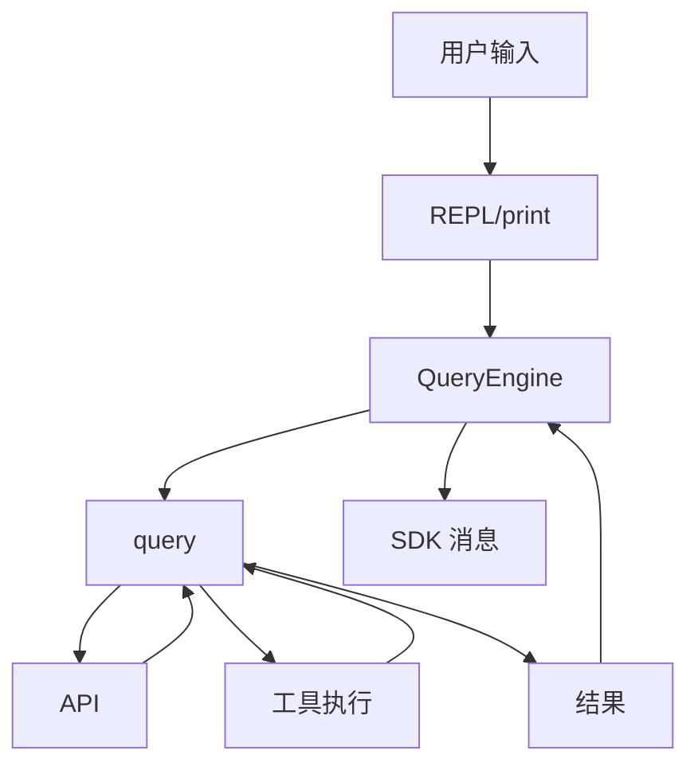
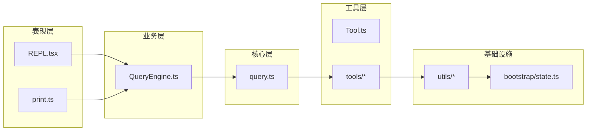

# 如何通过阅读 Claude Code 源码快速理解工业级 Agent 的设计

> 本指南是关于"如何高效阅读 Claude Code 源码"的方法论。
> 读完这份指南，你将拥有一套系统化的源码阅读策略，能从 17 万行代码中提取工业级 Agent 系统的设计精髓。

---

## 一、阅读前的心理建设

### 1.1 关键认知

Claude Code 包含 **1987 个 TypeScript/TSX 文件**（约 17 万行代码），但**千万不要试图一次性读完所有代码**。

**正确的阅读心态**：
- ✅ **先理解架构，再深入细节**
- ✅ **以调用链为线索，而不是按文件名**
- ✅ **关注"为什么这样设计"，而不只是"做了什么"**
- ✅ **80/20 法则：理解 20% 的核心代码，覆盖 80% 的设计精髓**

### 1.2 工具准备

```bash
# 1. 启用 codegraph（如果项目有 .codegraph/ 目录）
# 预计算的知识图谱可大幅提升导航效率

# 2. 配置好 TypeScript LSP
# VSCode 或 Cursor 中安装 TypeScript 扩展

# 3. 准备画图工具
# Mermaid / draw.io / Excalidraw 用于画架构图

# 4. 准备记录工具
# 笔记软件（Notion / Obsidian / Markdown）
```

### 1.3 项目结构概览

```
F:\Project\agent\coder\Claude-Code\
├── src/                    # 1987 个 TS/TSX 文件（核心代码）
│   ├── entrypoints/        # 入口点（cli、sdk、agentSdk）
│   ├── bootstrap/          # 全局基础状态（DAG 叶子）
│   ├── state/              # 响应式业务状态
│   ├── commands.ts         # 命令注册表
│   ├── Tool.ts             # 工具接口定义（元模型）
│   ├── query.ts            # 查询循环核心
│   ├── QueryEngine.ts      # Headless/SDK 会话引擎
│   ├── tools/              # 60+ 具体工具实现
│   ├── services/           # 外部服务集成（API、MCP）
│   ├── utils/              # 工具函数
│   ├── hooks/              # Hook 系统
│   ├── screens/            # REPL UI（React/Ink）
│   ├── components/         # 148 个 UI 组件
│   ├── cli/                # CLI 处理
│   └── ...
├── docs/                   # 已提炼的设计文档（先读这个！）
├── vendor/                 # 第三方依赖源码
└── shims/                  # 平台特定垫片
```

**关键洞察**：`docs/` 目录下的设计文档（`01-buddy.md` ~ `35-...`）是**已经提炼好的精华**，先读这些可以事半功倍。

---

## 二、第一阶段：宏观架构（1-2 天）

### 2.1 必读的入门文档

**最高优先级**（按顺序阅读）：

| 文档 | 价值 |
| --- | --- |
| `docs/17-architecture.md` | **最重要**：完整架构总览 |
| `docs/20-request-flow.md` | 请求从入口到输出的完整流程 |
| `docs/34-appstate-vs-state.md` | 双层状态系统对比 |
| `docs/35-dual-state-architecture.md` | 状态管理设计哲学 |
| `docs/31-bootstrap-state.md` | 全局状态管理 |

**阅读技巧**：
- 重点看架构图、流程图、模块关系
- 不需要记住所有细节，但要建立"全景图"
- 画一张自己的架构图，标出关键模块

### 2.2 理解两个核心引擎

```
┌─────────────────────────────────────────────────────┐
│  核心引擎对比                                          │
├─────────────────────────────────────────────────────┤
│  src/query.ts       - 单次查询循环（API 调用 + 工具执行）│
│  src/QueryEngine.ts - 会话生命周期（跨查询持久化）         │
│  src/Tool.ts        - 工具接口规范（60+ 工具的元模型）       │
└─────────────────────────────────────────────────────┘
```

**理解它们的协作关系**：
- `Tool.ts` 定义工具规范（接口层）
- `query.ts` 执行单次查询循环（运行时）
- `QueryEngine.ts` 封装多次查询的会话状态（生命周期层）

### 2.3 识别关键子系统

| 子系统 | 核心文件 | 作用 |
| --- | --- | --- |
| **工具系统** | `src/Tool.ts` + `src/tools/*` | 60+ 工具的统一规范 |
| **权限系统** | `src/utils/permissions/*` | 多层权限检查 |
| **Hook 系统** | `src/utils/hooks.ts` | 52 个生命周期钩子 |
| **MCP 集成** | `src/services/mcp/*` | Model Context Protocol |
| **会话持久化** | `src/utils/sessionStorage.ts` | JSONL transcript |
| **上下文压缩** | `src/services/compact/*` | 5 级压缩策略 |
| **流式工具执行** | `src/services/tools/StreamingToolExecutor.ts` | 并行工具执行 |
| **状态管理** | `src/state/*` + `src/bootstrap/state.ts` | 双层状态系统 |
| **CLI 入口** | `src/cli/print.ts` | Headless 模式 |
| **REPL UI** | `src/screens/REPL.tsx` | 交互式 UI |

---

## 三、第二阶段：核心流程追踪（3-5 天）

### 3.1 最佳起点：主流程入口

**最佳入口**：`docs/20-request-flow.md` 已经画好了完整的端到端流程。

```
用户输入
    ↓
REPL.tsx (或 print.ts)
    ↓
QueryEngine.ts (会话生命周期)
    ↓
query.ts (单次查询循环)
    ↓
services/api/claude.ts (Anthropic API)
    ↓
工具执行循环
    ↓
返回结果
```

### 3.2 逐步深入的阅读顺序

#### 第一步：理解 `Tool.ts` 的元模型

```ts
// 重点理解的接口结构
type Tool<Input, Output> = {
  name: string
  call(args, context, ...): Promise<ToolResult<Output>>
  description(input, options): Promise<string>
  inputSchema: Input
  isReadOnly?(input): boolean
  isConcurrencySafe?(input): boolean
  isEnabled(): boolean
  checkPermissions(input, context): Promise<PermissionResult>
  renderToolUseMessage(input, options): React.ReactNode
  // ... 30+ 方法
}
```

**学习要点**：
- 工具如何声明元数据（inputSchema、description）
- 工具如何处理权限（checkPermissions）
- 工具如何渲染 UI（renderToolUseMessage）

#### 第二步：阅读 2-3 个代表性工具

**推荐阅读顺序**（按难度递增）：

1. **`src/tools/FileReadTool/FileReadTool.ts`** —— 最简单
   - 只读、并发安全
   - 展示基本的工具实现

2. **`src/tools/BashTool/BashTool.ts`** —— 中等
   - 命令解析 + 权限检查
   - 安全相关的复杂逻辑

3. **`src/tools/AgentTool/`** —— 最复杂
   - 子 agent 调度
   - 递归调用模型

#### 第三步：理解 `query.ts` 的循环

```ts
// src/query.ts 核心结构
async function* query(params) {
  while (true) {
    // 1. 决定是否触发压缩
    if (isAutoCompactEnabled()) { ... }
    
    // 2. 调用 API（流式）
    for await (const event of queryModelWithStreaming(...)) {
      // 3. 处理各种事件
      // text / thinking / tool_use / ...
    }
    
    // 4. 执行工具
    await runTools(...)
    
    // 5. 决定是否继续循环
    if (decision === 'end_turn') return
  }
}
```

**学习要点**：
- 为什么用 `async function*`（异步生成器）
- 流式 API 调用的处理
- 工具并行执行
- 错误恢复

#### 第四步：理解 `QueryEngine.ts`

```ts
// 重点理解的类结构
class QueryEngine {
  // 跨查询持续的状态
  private mutableMessages: Message[]
  private permissionDenials: SDKPermissionDenial[]
  private totalUsage: NonNullableUsage
  
  // 提交一条消息
  async* submitMessage(prompt): AsyncGenerator<SDKMessage> {
    // 1. 系统 prompt 构建
    // 2. 用户输入处理
    // 3. 调用 query()
    // 4. 标准化为 SDK 消息
    // 5. yield SDKMessage
  }
}
```

**学习要点**：
- 会话状态的封装
- SDK 消息的标准化
- 与 `ask()` 包装函数的关系

#### 第五步：理解权限系统

**核心文件**：
- `src/utils/permissions/permissions.ts`（1486 行）
- `src/tools/BashTool/bashPermissions.ts`

**学习要点**：
- 多层权限检查（rules → classifier → hook）
- 危险命令的识别
- 权限缓存

#### 第六步：理解 Hook 系统

**核心文件**：
- `src/utils/hooks.ts`（5297 行）
- 52 个 HookEvent 类型

**学习要点**：
- 钩子的注册与触发
- 同步 vs 异步钩子
- 钩子链的控制

---

## 四、第三阶段：提炼核心设计模式

### 4.1 关注这些关键设计模式

#### (1) 装饰器模式

```ts
// QueryEngine.ts 中的 wrappedCanUseTool
const wrappedCanUseTool = async (...args) => {
  const result = await canUseTool(...args)
  if (result.behavior !== 'allow') {
    this.permissionDenials.push(...)  // 拦截 + 记录
  }
  return result
}
```

#### (2) 工厂模式 + 默认值填充

```ts
// Tool.ts 中的 buildTool
function buildTool(def: ToolDef): Tool {
  return {
    ...TOOL_DEFAULTS,
    userFacingName: () => def.name,
    ...def,
  }
}
```

#### (3) 观察者模式 + 不可变更新

```ts
// store.ts
function createStore<T>(initialState: T) {
  return {
    setState: (updater) => {
      const next = updater(state)
      if (Object.is(next, state)) return  // 短路优化
      state = next
      for (const listener of listeners) listener()
    },
    subscribe: (listener) => {...}
  }
}
```

#### (4) 异步生成器 + 流式处理

```ts
// query.ts 中大量使用
async function* query(params) {
  for await (const event of apiCall(...)) {
    yield event
  }
}
```

#### (5) 特性门控 + 死代码消除

```ts
// 仅在某个 feature 开启时引入
const coordinatorModeModule = feature('COORDINATOR_MODE')
  ? require('./coordinator/coordinatorMode.js')
  : null
```

#### (6) DAG 叶子节点

```ts
// bootstrap/state.ts
// "DO NOT ADD MORE STATE HERE - BE JUDICIOUS WITH GLOBAL STATE"
// 不被 src/utils/ 依赖，是稳定的叶子节点
```

#### (7) Feature Gates 三层门控

```ts
// 编译时：bun:bundle dead-code elimination
feature('BUDDY')

// 用户类型：内部功能
process.env.USER_TYPE === 'ant'

// 远程配置：A/B 测试
getFeatureValue_CACHED_MAY_BE_STALE('tengu_kairos', false)
```

### 4.2 关注"非显而易见"的设计决策

| 决策 | 为什么这样 |
| --- | --- |
| 异步生成器 vs Promise | 流式处理、可中断、节省内存 |
| `Object.is` 短路 | 避免不必要的状态通知 |
| latch 字段（`boolean | null`）| 避免 prompt cache bust |
| 引用 vs 索引的水位标记 | 适应环形缓冲区 |
| 早写-早 flush | 防止中途被杀导致 transcript 丢失 |
| `feature()` 替代字符串常量 | 编译时 dead-code elimination |

---

## 五、阅读源码的具体技巧

### 5.1 使用 grep 跟踪关键符号

```bash
# 跟踪一个关键函数的所有调用
grep -rn "canUseTool" src/ --include="*.ts" | head -20

# 跟踪一个关键类型的所有使用
grep -rn "ToolPermissionContext" src/ --include="*.ts"

# 跟踪一个环境变量的所有引用
grep -rn "CLAUDE_CODE_EAGER_FLUSH" src/

# 跟踪一个类的所有继承者
grep -rn "extends Tool\|implements Tool" src/ --include="*.ts"
```

### 5.2 使用 codegraph 高效导航

如果项目配置了 `.codegraph/`，使用 MCP 的 `codegraph_explore` 工具：

```
推荐查询示例：
- "QueryEngine 和 query.ts 的调用关系是什么？"
- "Tool 接口的所有实现类有哪些？"
- "MCP 服务器连接的生命周期是怎样的？"
- "permissionDenied 字段在哪里被写入？"
- "ProcessUserInputContext 的核心字段是什么？"
```

### 5.3 善用 IDE 的"调用层次"功能

在 VSCode/Cursor 中：
- **右键点击函数** → "查找所有引用"（Find All References）
- **右键点击类型** → "查找实现"（Find Implementations）
- **F12** 跳转到定义
- **Shift+F12** 查看所有引用
- **Ctrl+T** 跳转到工作区符号

### 5.4 编写结构化阅读笔记

**推荐笔记模板**：

```markdown
# 模块：[模块名]

## 核心职责
- ...

## 关键类型
- Type A：用途 + 关键字段
- Type B：用途 + 关键字段

## 关键函数
- func1()：输入输出 + 副作用
- func2()：输入输出 + 副作用

## 与其他模块的关系
- 依赖：...
- 被依赖：...

## 关键设计决策
- 决策 1：背景 + 为什么这样选择
- 决策 2：背景 + 为什么这样选择

## 仍有疑问
- ...
```

### 5.5 画图辅助理解

**必画的图**：



**可用的图类型**：
- **架构图**：模块依赖关系
- **时序图**：调用顺序
- **状态机图**：状态转换
- **数据流图**：数据如何流转

---

## 六、源码阅读优先级清单

### 6.1 第一优先级（必读）

```
1. docs/17-architecture.md       # 架构总览
2. docs/20-request-flow.md      # 完整流程
3. docs/34-appstate-vs-state.md # 状态管理
4. src/Tool.ts                  # 工具接口定义
5. src/query.ts                 # 查询循环
6. src/QueryEngine.ts           # 会话生命周期
```

### 6.2 第二优先级（重要）

```
7. src/tools/FileReadTool/FileReadTool.ts
8. src/tools/BashTool/BashTool.ts
9. src/utils/permissions/permissions.ts
10. src/services/api/claude.ts
11. src/state/AppStateStore.ts
12. src/state/store.ts
13. src/bootstrap/state.ts
```

### 6.3 第三优先级（进阶）

```
14. src/utils/hooks.ts
15. src/services/compact/*
16. src/services/tools/StreamingToolExecutor.ts
17. src/services/mcp/*
18. src/cli/print.ts
19. src/screens/REPL.tsx
```

### 6.4 第四优先级（专题）

根据兴趣选择：
- **多 agent 系统**：`src/tools/AgentTool/`
- **流式处理**：`src/services/api/claude.ts`
- **MCP 协议**：`src/services/mcp/`
- **UI 渲染**：`src/components/`
- **压缩策略**：`src/services/compact/`

---

## 七、提炼工业级 Agent 的关键洞察

### 7.1 设计哲学层面的洞察

#### (1) 关注点分离是核心

```
┌─────────────────────────────────────────┐
│  表现层（REPL/print）                      │
├─────────────────────────────────────────┤
│  业务层（QueryEngine）                     │
├─────────────────────────────────────────┤
│  核心层（query.ts）                        │
├─────────────────────────────────────────┤
│  工具层（Tool.ts + tools/）                │
├─────────────────────────────────────────┤
│  基础设施层（utils/、bootstrap/state）       │
└─────────────────────────────────────────┘
```

#### (2) 状态管理的双层架构

- **底层**：`bootstrap/state.ts`（DAG 叶子，跨模块基础数据）
- **高层**：`AppStateStore`（响应式，业务逻辑）

#### (3) 配置 vs 代码的平衡

```ts
// 工具实现主要在代码中
src/tools/FileReadTool/FileReadTool.ts

// 行为调整主要在配置中
~/.claude/settings.json
.claude/settings.local.json
```

### 7.2 实现层面的洞察

#### (1) 异步生成器是流式 Agent 的核心

```ts
// 异步生成器支持：
// 1. 流式输出（不必等待全部完成）
// 2. 可中断（abort signal）
// 3. 节省内存（不缓存所有结果）
async function* query(params) {
  for await (const event of apiCall(...)) {
    yield event
  }
}
```

#### (2) 装饰器模式处理横切关注点

```ts
// 权限拦截、性能追踪、错误处理都用装饰器
const wrappedCanUseTool = async (...args) => {
  const result = await originalFn(...args)
  // 副作用：记录拒绝
  if (result.behavior !== 'allow') {
    this.permissionDenials.push(...)
  }
  return result
}
```

#### (3) Feature Gates 控制产品分层

```ts
// 编译时：bun:bundle 剪枝
const module = feature('BUDDY') ? require('./buddy.js') : null

// 运行时：远程配置
const enabled = getFeatureValue_CACHED_MAY_STALE('tengu_kairos', false)
```

#### (4) 性能优化藏在细节

```ts
// Object.is 短路
if (Object.is(next, prev)) return

// 引用而不是索引
const watermark = getInMemoryErrors().at(-1)  // 环形缓冲区

// 缓存 + latch 防止 bust prompt cache
afkModeHeaderLatched: boolean | null  // 一旦置 true 不再回退
```

### 7.3 工程实践层面的洞察

#### (1) 测试隔离通过 reset 模板

```ts
// 自动覆盖所有字段
export function resetStateForTests(): void {
  Object.entries(getInitialState()).forEach(([key, value]) => {
    STATE[key as keyof State] = value as never
  })
}
```

#### (2) 错误处理分层

```
底层错误：logError 收集到 inMemoryErrorLog
中层错误：try/catch + 友好消息
顶层错误：result 消息 + diagnostic 信息
```

#### (3) 类型即文档

```ts
// TypeScript 类型本身就是文档
type Tool<Input, Output, Progress> = {
  call(args: z.infer<Input>, context: ToolUseContext, ...): Promise<ToolResult<Output>>
  // ... 30+ 字段，每个都有详细的 JSDoc
}
```

---

## 八、常见误区与避免

### 8.1 误区 1：从头线性阅读

**❌ 错误方式**：
```bash
# 按文件名顺序一个个读
src/main.tsx → src/QueryEngine.ts → src/query.ts → ...
```

**✅ 正确方式**：
- 先读架构文档
- 确定核心模块
- 按"调用链"阅读

### 8.2 误区 2：试图理解每个细节

**❌ 错误方式**：
- 一个文件读 2 小时
- 每个函数都搞清楚

**✅ 正确方式**：
- 80/20 法则：理解 20% 的代码覆盖 80% 的功能
- 先理解"做什么"，再深入"怎么做"

### 8.3 误区 3：忽略注释

**❌ 错误方式**：
- 跳过注释只看代码

**✅ 正确方式**：
- Claude Code 的注释非常丰富（每个文件顶部都有架构说明）
- 关键决策的注释比代码更重要
- 注释展示了作者的思考过程

### 8.4 误区 4：不读测试

**❌ 错误方式**：
- 只看实现代码

**✅ 正确方式**：
- 测试展示了 API 的正确使用方式
- 测试用例是最简洁的"文档"
- 测试中的 assert 揭示了函数的契约

### 8.5 误区 5：只看不练

**❌ 错误方式**：
- 只阅读，不实践

**✅ 正确方式**：
- 编写笔记巩固理解
- 画图梳理关系
- 实现简化版本验证理解
- 尝试修改并观察效果

---

## 九、推荐的学习路径（4 周时间表）

### 第 1 周：宏观架构

**目标**：建立全景图

| 日期 | 任务 |
| --- | --- |
| Day 1 | 阅读所有 docs/ 下的设计文档 |
| Day 2 | 理解 4 层架构（表现/业务/核心/工具/基础） |
| Day 3 | 绘制完整的架构图 |
| Day 4-5 | 阅读双状态系统文档（34、35） |

### 第 2 周：核心引擎

**目标**：掌握核心循环

| 日期 | 任务 |
| --- | --- |
| Day 1-2 | 深入阅读 `Tool.ts`、`query.ts`、`QueryEngine.ts` |
| Day 3-4 | 实现 2-3 个代表性工具（FileReadTool、BashTool） |
| Day 5 | 理解异步生成器的使用 |

### 第 3 周：核心子系统

**目标**：理解支撑系统

| 日期 | 任务 |
| --- | --- |
| Day 1-2 | 权限系统（permissions） |
| Day 3-4 | Hook 系统 |
| Day 5 | MCP 集成 |

### 第 4 周：高级主题

**目标**：了解扩展机制

| 日期 | 任务 |
| --- | --- |
| Day 1 | 多 agent 系统（AgentTool） |
| Day 2 | 上下文压缩（compact） |
| Day 3 | 流式工具执行 |
| Day 4 | UI 系统（REPL/Ink） |
| Day 5 | Headless 模式（print.ts） |

### 持续学习

- 阅读代码同时记录设计决策
- 对比自己的项目，思考可借鉴的设计
- 实现一个简化版的 Agent 系统作为练习

---

## 十、实用工具与资源

### 10.1 推荐的 IDE 设置

```json
// .vscode/settings.json
{
  "typescript.tsdk": "node_modules/typescript/lib",
  "typescript.enablePromptUseWorkspaceTsdk": true,
  "editor.wordWrap": "on",
  "editor.codeLens": true,
  "editor.stickyScroll.enabled": true,
  "files.trimTrailingWhitespace": true,
  "files.insertFinalNewline": true
}
```

### 10.2 推荐安装的扩展

- **TypeScript LSP**：智能跳转
- **Mermaid 预览**：画架构图
- **Todo Tree**：管理阅读进度
- **Code Outline**：代码大纲

### 10.3 阅读时的检查清单

每读完一个模块，问自己：

- [ ] 这个模块的核心职责是什么？
- [ ] 它暴露了哪些公开 API？
- [ ] 它依赖哪些其他模块？
- [ ] 它的关键设计决策是什么？
- [ ] 哪些代码模式可以借鉴？
- [ ] 我能用一句话概括这个模块吗？

---

## 十一、把阅读变成产出

### 11.1 写学习笔记

**模板**：

```markdown
# Claude Code 源码学习笔记

## 日期：[YYYY-MM-DD]

## 阅读内容
- ...

## 关键洞察
1. ...
2. ...

## 可借鉴的设计
- ...

## 仍有疑问
- ...
```

### 11.2 绘制架构图

用 Mermaid 绘制：



### 11.3 实现简化版本

**练手项目**：

1. **实现一个简化版的工具系统**
   - 定义 Tool 接口
   - 实现 2-3 个简单工具
   - 体验 buildTool 工厂模式

2. **实现一个简化版的会话管理**
   - 实现 QueryEngine 的核心
   - 体验异步生成器

3. **实现一个简化版的权限系统**
   - 实现多层权限检查
   - 体验规则引擎

通过实现加深理解。

---

## 十二、工业级 Agent 的 10 个关键特征

从 Claude Code 中提炼：

| 特征 | 体现 |
| --- | --- |
| **关注点分离** | 4 层架构清晰 |
| **DAG 叶子约束** | `bootstrap/state.ts` 不被 utils 依赖 |
| **异步生成器** | 流式处理核心 |
| **装饰器模式** | 权限拦截、横切关注点 |
| **观察者模式** | AppStateStore |
| **特性门控** | 编译时 + 运行时 + 远程配置 |
| **类型驱动** | TypeScript 类型即文档 |
| **测试隔离** | resetStateForTests 自动覆盖 |
| **缓存优化** | latch 字段防 prompt cache bust |
| **错误处理** | 分层错误收集与上报 |

---

## 十三、核心要点回顾

### 13.1 阅读源码的 5 个原则

1. **先架构后细节**：先理解整体，再深入具体
2. **以文档为入口**：`docs/` 目录下是精华
3. **按调用链阅读**：从入口到出口
4. **关注设计决策**：理解"为什么"比"是什么"更重要
5. **提炼通用模式**：抽象出可复用的设计模式

### 13.2 一句话总结

**阅读工业级 Agent 源码 = 宏观架构 + 调用链追踪 + 设计模式提炼 + 工程实践学习**

---

## 十四、推荐资源

### 14.1 Claude Code 自带文档

**必读**：

```
docs/
├── 17-architecture.md           # 架构总览
├── 20-request-flow.md          # 完整流程
├── 34-appstate-vs-state.md     # 状态系统
├── 35-dual-state-architecture.md # 状态架构设计哲学
└── 32-query-engine.md          # QueryEngine 详解
```

**进阶**：

```
docs/
├── 31-bootstrap-state.md       # 全局状态
├── 33-headless-print-design.md # Headless 模式
└── ...
```

### 14.2 源码优先级阅读

```bash
# 第一梯队（必读）
src/Tool.ts                    # 工具接口
src/query.ts                   # 查询循环
src/QueryEngine.ts             # 会话引擎

# 第二梯队（重要）
src/state/AppStateStore.ts
src/state/store.ts
src/bootstrap/state.ts
src/tools/FileReadTool/FileReadTool.ts
src/tools/BashTool/BashTool.ts
src/services/api/claude.ts
```

---

## 十五、实战案例：从一个问题出发

**推荐从一个具体问题开始**：

> "Claude Code 是怎么处理工具调用的？"

**按以下步骤回答**：

1. 读 `Tool.ts` 接口定义（理解工具规范）
2. 读 `FileReadTool` 实现（理解工具如何实现）
3. 读 `query.ts` 中的工具调用循环（理解何时调用工具）
4. 读 `QueryEngine.ts` 中的 `canUseTool` 装饰器（理解权限检查）
5. 读 `permissions.ts` 中的权限检查（理解权限决策）
6. 读 `StreamingToolExecutor.ts`（理解工具执行）

这样一次**小而完整的探索**，比盲目阅读整个 codebase 高效得多。

**类似的问题示例**：

- "Claude Code 是怎么处理流式响应的？"
- "Claude Code 是怎么做上下文压缩的？"
- "Claude Code 是怎么处理权限的？"
- "Claude Code 是怎么支持多 agent 的？"
- "Claude Code 是怎么处理 MCP 服务器的？"

每个问题都可以通过类似的 5-7 步探索找到答案。

---

## 十六、最后的话

阅读 Claude Code 这样的工业级 Agent 源码是一个**系统性工程**，需要：

- **方法论**：遵循本文档的建议
- **耐心**：不要期望一次理解所有
- **实践**：通过笔记、画图、复现加深理解
- **提炼**：抽象出可复用的设计模式

最终目标不是"读完所有代码"，而是**理解工业级 Agent 的设计思想**，并能应用到自己的项目中。

**核心要点**：

1. **从架构开始**：先读 docs/ 下的设计文档
2. **以调用链为线索**：从用户输入到模型输出
3. **关注设计决策**：理解"为什么"比"是什么"更重要
4. **提炼设计模式**：抽象出可复用的模式
5. **通过练习巩固**：实现简化版本验证理解

**祝你在 Claude Code 源码的海洋中，找到属于自己的宝藏！** 🎯