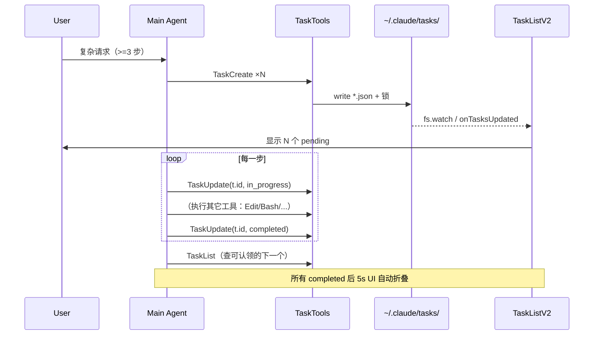

# Claude Code 任务规划系统设计文档

> 范围：`src/utils/tasks.ts`、`src/utils/todo/types.ts`、`src/hooks/useTasksV2.ts`、`src/components/TaskListV2.tsx`、`src/tools/Task*` 系列工具，以及它们与 AppState / query 循环 / 持久化的连接。
>
> 文中代码引用均使用 `file:line` 形式，可点击跳转。

## 1. 概述

Claude Code 的"任务规划"包含两套并行但**互斥**的机制：

| 代际 | 工具集 | 状态来源 | 存储位置 | 启用条件 |
| --- | --- | --- | --- | --- |
| **V1** Todo | `TodoWrite` | `AppState.todos[agentId]` | 内存 | `!isTodoV2Enabled()` |
| **V2** Tasks | `TaskCreate` / `TaskGet` / `TaskUpdate` / `TaskList` / `TaskStop` | `~/.claude/tasks/<taskListId>/*.json` | 磁盘（文件锁） | `isTodoV2Enabled()` |

切换开关在 `src/utils/tasks.ts:133`：

```ts
export function isTodoV2Enabled(): boolean {
  if (isEnvTruthy(process.env.CLAUDE_CODE_ENABLE_TASKS)) return true
  return !getIsNonInteractiveSession()
}
```

- 交互式 CLI（人类使用的 REPL）默认走 V2，提供持久化、文件锁、跨 agent 共享、UI 列表。
- 非交互式 SDK 会话默认走 V1（`TodoWrite`），保持 tool surface 极简。
- 通过 `CLAUDE_CODE_ENABLE_TASKS=1` 强制开启 V2，常被 SDK 用户用于替代 `TodoWrite`。

工具注册发生在 `src/tools.ts:220`，互斥逻辑：

```ts
...(isTodoV2Enabled()
  ? [TaskCreateTool, TaskGetTool, TaskUpdateTool, TaskListTool]
  : []),
```

注意 `TodoWriteTool` 始终注册（`src/tools.ts:210`），由 `isEnabled()` 在 V2 启用时自动隐藏（`src/tools/TodoWriteTool/TodoWriteTool.ts:52`）。这种"两套注册，按 feature gate 显隐"的写法避免了配置工具集合的复杂度。

## 2. 数据模型

### 2.1 V1 Todo（`src/utils/todo/types.ts`）

```ts
TodoItem = { content: string; status: 'pending' | 'in_progress' | 'completed'; activeForm: string }
TodoList  = TodoItem[]
```

- **无 ID**：靠数组下标定位。
- **无依赖关系**：纯线形清单。
- **无 owner**：所有 todo 归属当前 agentId，存于 `AppState.todos[agentId]`（`src/state/AppStateStore.ts:220`）。
- **仅状态**：`pending` → `in_progress` → `completed`，缺少 `deleted` 和 blockedBy。

### 2.2 V2 Task（`src/utils/tasks.ts:76`）

```ts
Task = {
  id: string                // 自增整数（见 §4.2）
  subject: string           // 标题（祈使句）
  description: string       // 详情
  activeForm?: string       // 进行时态（spinner 文案）
  owner?: string            // agent 名称
  status: 'pending' | 'in_progress' | 'completed'
  blocks: string[]          // A 在 blocks 里 ⇒ A 阻塞 B
  blockedBy: string[]       // B 在 blockedBy 里 ⇒ B 被 A 阻塞
  metadata?: Record<string, unknown>
}
```

- **有 ID**：单调递增，便于工具间引用（`addBlocks` / `addBlockedBy`）。
- **有依赖图**：`blocks` / `blockedBy` 是同一关系的双向记录（`blockTask` 双向写入，`src/utils/tasks.ts:458`）。
- **有 owner**：多 agent 协作时可被队友认领。
- **有 metadata**：可用于挂任意上下文（如 `_internal` 标记隐藏任务，见 `TaskListTool.ts:69`）。

V2 状态机只支持三种状态：写入 `status: 'deleted'` 由 `TaskUpdateTool` 拦截后调用 `deleteTask()`（`TaskUpdateTool.ts:213`）。这是 V1 缺乏的"软删除"语义的扩展点。

### 2.3 后台运行时任务（`src/Task.ts`，**另一套**）

注意 `src/Task.ts` 中定义的 `TaskStateBase` / `Task` 是**后台执行**的 agent / shell / workflow 实例的状态机（type ∈ `local_bash | local_agent | remote_agent | in_process_teammate | local_workflow | monitor_mcp | dream`），与本文档讨论的"任务规划"系统**不是同一概念**，但通过 `TaskStop` 工具桥接——`TaskStopTool` 同时认识两套 ID。详见 §7。

## 3. 任务注册中心（V2 数据层）

`src/utils/tasks.ts` 是 V2 的单一数据访问层。所有公开函数：

| 函数 | 行号 | 作用 |
| --- | --- | --- |
| `getTaskListId()` | 199 | 解析当前 task list 的命名空间 |
| `getTasksDir(id)` | 221 | 拼出 `~/.claude/tasks/<id>/` |
| `getTaskPath(id, taskId)` | 229 | 单文件路径 `<id>.json` |
| `createTask` | 284 | 原子地分配下一个 ID 并写盘 |
| `getTask` | 310 | 读单个文件 + Zod schema 校验 + 旧格式迁移 |
| `updateTask` | 370 | 文件级锁 + 写 |
| `deleteTask` | 393 | 删文件 + 提升 high water mark + 清理其他任务对该 ID 的引用 |
| `listTasks` | 443 | 读整个目录 |
| `blockTask` | 458 | 双向写入 `blocks` / `blockedBy` |
| `claimTask` | 541 | 原子声明所有权（带 `checkAgentBusy` 选项） |
| `resetTaskList` | 147 | 整列清空（swarm 重置时调用） |
| `onTasksUpdated` / `notifyTasksUpdated` | 53 / 61 | 进程内发布订阅（`createSignal`） |

### 3.1 命名空间解析

`getTaskListId()` 是协作的关键。优先级：

1. 环境变量 `CLAUDE_CODE_TASK_LIST_ID`（显式注入）。
2. 当前是 in-process teammate → 取出 leader 的 team name。
3. 环境变量 `CLAUDE_CODE_TEAM_NAME`（基于进程的 teammate）。
4. 内存中的 `leaderTeamName`（由 `TeamCreateTool` 通过 `setLeaderTeamName` 设置，`tasks.ts:33`）。
5. 退回到当前 session ID（standalone 模式）。

第 4 步的设计意图是：leader 进程创建 task list 后，所有 in-process teammate 自动看到同一份文件；tmux/iTerm2 teammate 通过 `CLAUDE_CODE_TEAM_NAME` 也能落到同一目录（`tasks.ts:202-209` 的注释）。

### 3.2 文件锁与并发

所有写操作都通过 `proper-lockfile` 加锁，关键参数（`tasks.ts:102`）：

```ts
const LOCK_OPTIONS = { retries: { retries: 30, minTimeout: 5, maxTimeout: 100 } }
```

- 单任务粒度锁：写在 `getTaskPath(...)` 的 lockfile（`updateTask` 用）。
- 整个 task list 粒度锁：`<dir>/.lock`，用于 `createTask` 和 `claimTaskWithBusyCheck`，因为 ID 分配需要看到全局状态。
- 锁预算：30 次重试，最长约 2.6 s，覆盖 10+ 并发 agent 场景。
- `updateTaskUnsafe`（`tasks.ts:354`）是给已持锁调用者（`claimTask`、`deleteTask` 级联清理）使用的"无锁版"，避免重入死锁。

### 3.3 ID 分配与 high water mark

`createTask` 不维护内存计数器，而是每次都 `readdir` + `readFile(.highwatermark)`，取两者中较大者 +1（`tasks.ts:271`）。这避免：

- 重启后 ID 重复；
- `resetTaskList` 之后旧 ID 不被复用（`tasks.ts:147` 先把当前最高 ID 写入 `.highwatermark` 再清空）。

`deleteTask`（`tasks.ts:393`）也会先把被删 ID 写入 high water mark——确保即使文件消失，ID 也不会再被分配给新任务。

### 3.4 进程内事件总线

```ts
const tasksUpdated = createSignal()             // tasks.ts:39
export const onTasksUpdated = tasksUpdated.subscribe
export function notifyTasksUpdated() { try { tasksUpdated.emit() } catch {} }
```

任何写操作（`createTask` / `updateTask` / `deleteTask` / `setLeaderTeamName`）末尾都调一次 `notifyTasksUpdated()`。订阅者：

- `useTasksV2` 的 `TasksV2Store`（`hooks/useTasksV2.ts:66`），用于 UI 即时刷新；
- 其它关心 task list 切换的组件。

**关键设计**：监听用 `try/catch` 包裹，写操作不被订阅者异常拖垮（`tasks.ts:62-65` 的注释）。

## 4. 工具集（V2 规划系统）

四个核心规划工具 + 一个停止后台任务的 `TaskStop`：

### 4.1 TaskCreate（`src/tools/TaskCreateTool/TaskCreateTool.ts:48`）

```ts
input = { subject, description, activeForm?, metadata? }
output = { task: { id, subject } }
```

关键点：

- **不接收 ID**：服务端 `createTask` 分配。
- **不可并发安全标记**：`isConcurrencySafe() = true`（`TaskCreateTool.ts:71`）——多个 TaskCreate 串行化由 `getTaskListId` 粒度的锁保证。
- **创建后自动展开**：`expandedView = 'tasks'`（`TaskCreateTool.ts:116-119`），让用户立即看到新任务。
- **TaskCreated hook 拦截**：`executeTaskCreatedHooks` 可返回 `blockingError`，命中则回滚（`TaskCreateTool.ts:110-113`），用于企业策略（命名规范、安全检查等）。

### 4.2 TaskUpdate（`src/tools/TaskUpdateTool/TaskUpdateTool.ts:88`）

最复杂的工具——同时承担"改字段 / 改状态 / 改依赖 / 改 owner / 软删除"五种语义。

```ts
input = { taskId, subject?, description?, activeForm?, status?,
          addBlocks?, addBlockedBy?, owner?, metadata? }
output = { success, taskId, updatedFields, statusChange?,
          verificationNudgeNeeded? }
```

实现分四步：

1. **存在性预检**（`TaskUpdateTool.ts:146`）——`getTask` 返回 null 时优雅返回，不抛错。
2. **字段差分**（`TaskUpdateTool.ts:161-211`）——只对发生变化的字段才打 `updatedFields`，并把传入的 metadata 与现有合并（设 null 即删除）。
3. **状态语义**（`TaskUpdateTool.ts:212-269`）——`status === 'deleted'` 走 `deleteTask`；`status === 'completed'` 触发 `TaskCompleted` hook；其它合法状态写入。
4. **依赖**（`TaskUpdateTool.ts:301-323`）——`addBlocks` 反向写入 `blockedBy`，`addBlockedBy` 正向写入 `blocks`，自动去重。

两个隐式行为：

- **自动认领**（`TaskUpdateTool.ts:188-199`）——当 agent swarms 启用且任务进入 `in_progress` 而未传 owner 时，自动把 owner 设为 `getAgentName()`。
- **邮件通知**（`TaskUpdateTool.ts:277-298`）——owner 变更时通过 `writeToMailbox` 投递 `task_assignment` 消息。
- **结构化校验提醒**（`TaskUpdateTool.ts:333-349`）——一次性关闭 3+ 任务且无 verification 步骤时，附加 `verificationNudgeNeeded` 提示去派验证子 agent。这条逻辑被 `mapToolResultToToolResultBlockParam` 翻译为可读字符串追加到 tool result（`TaskUpdateTool.ts:396-398`）。

### 4.3 TaskGet / TaskList（`src/tools/TaskGetTool/`, `src/tools/TaskListTool/`）

只读工具，`isReadOnly() = true`。两点设计：

- `TaskList` 过滤掉 `metadata._internal` 的内部任务（`TaskListTool.ts:69`）。
- `TaskList` 自动把已经 `completed` 的 blocker 从 `blockedBy` 里抹掉（`TaskListTool.ts:81-82`）——已完成的前置任务不应再被当成阻塞，模型据此可立即认领后续任务。
- `TaskList` 输出用 `#<id> [status] subject` 的纯文本（`TaskListTool.ts:101-108`），便于模型一眼解析和后续引用。

### 4.4 TaskStop（`src/tools/TaskStopTool/TaskStopTool.ts:39`）

```ts
input = { task_id?, shell_id? }   // shell_id 是 KillShell 的别名，向后兼容
```

`call` 直接委托给 `src/tasks/stopTask.ts:38`：

1. 校验存在性 + `status === 'running'`。
2. `getTaskByType(task.type)` 取出对应 `Task` 实现（`src/tasks.ts:37`）。
3. 调用 `taskImpl.kill(taskId, setAppState)`——具体实现见各 `tasks/*/` 目录（`LocalShellTask` 走 `kill -9`；`RemoteAgentTask` 走 `archiveRemoteSession`；`DreamTask` 走 `AbortController` + 回滚锁 mtime）。
4. 对 local shell 抑制 "exit code 137" 噪音（`stopTask.ts:67-95`），但显式 emit `task_terminated` SDK 事件以让消费者知情。

### 4.5 工具注册表总览

```
src/tools.ts:210  TodoWriteTool                // V1，isEnabled() 决定显隐
src/tools.ts:212  TaskStopTool                 // V2 + 后台任务共用
src/tools.ts:220  TaskCreateTool | TaskGetTool | TaskUpdateTool | TaskListTool   // V2
```

所有 V2 工具都标记 `shouldDefer: true`——它们可以延迟到执行前再加载，配合 tool search 减小 system prompt 体积。

## 5. UI 呈现

### 5.1 TaskListV2 组件（`src/components/TaskListV2.tsx`）

主要在两处渲染：

- Spinner 下方（`src/components/Spinner.tsx:284`）——非独立模式，简洁。
- REPL 主体内（`src/screens/REPL.tsx:4661`）——独立模式，附 "N tasks (X done, Y in progress, Z open)" 标题。

视觉规则：

- 状态图标：`figures.tick` / `figures.squareSmallFilled` / `figures.squareSmall`（`TaskListV2.tsx:225-240`）。
- in_progress 加粗、completed 加删除线、blocked 降亮。
- owner 名称按 `AGENT_COLOR_TO_THEME_COLOR` 映射到 teammate 主题色（`TaskListV2.tsx:94-104`）。
- 列宽自适应：`columns < 60` 时省略 owner（`TaskListV2.tsx:268`）。
- 任务过多时按"最近 30s 完成 → in_progress → pending（未阻塞优先）→ 旧完成"优先级截断（`TaskListV2.tsx:138-164`），溢出用 `… +X in progress, Y pending, Z completed` 摘要收尾（`TaskListV2.tsx:170-185`）。

### 5.2 useTasksV2 Hook（`src/hooks/useTasksV2.ts`）

单例 store + `useSyncExternalStore` 模式：

- **单例**（`useTasksV2.ts:30`）——所有订阅者（Spinner、REPL、PromptInputFooterLeftSide）共享同一个 `TasksV2Store`，避免 Spinner 频繁 mount/unmount 触发 `fs.watch` 反复开关。
- **三路刷新源**：
  1. `onTasksUpdated` 进程内信号（`useTasksV2.ts:66`）——同进程内写操作触发。
  2. `fs.watch` 监听 tasks 目录（`useTasksV2.ts:86`）——其它进程（如 tmux teammate）写入时刷新。
  3. 5 s 兜底轮询（`useTasksV2.ts:140-167`）——`fs.watch` 不可靠时的后备。
- **5 s 自动隐藏**（`useTasksV2.ts:124-135`）——所有任务完成后 5 s 折叠 UI，避免屏幕常驻列表。`useTasksV2WithCollapseEffect`（`useTasksV2.ts:237-249`）还会在折叠时把 `expandedView` 设回 `'teammates'`，让出视觉焦点。
- **快照稳定**（`useTasksV2.ts:55`）——`getSnapshot` 只在 fetch 完成时返回新引用，满足 `useSyncExternalStore` 对 `Object.is` 稳定性的要求。

## 6. 任务规划的工作流

从用户视角，模型（agent）使用 V2 系统的典型时序：



关键设计要点（对照源码）：

1. **不要在第一步就批量创建并立即全部 in_progress**——`getTaskIcon`（`TaskListV2.tsx:220`）只允许一个 in_progress 视觉上高亮；UI 暗示"同一时间做一件"。
2. **进入 in_progress 之前创建**——`TaskUpdateTool` 自身不强制，但 prompt（`TaskUpdateTool/prompt.ts`）明确要求。
3. **依赖图通过 addBlocks / addBlockedBy 表达**——例如 `TaskUpdate({taskId: '3', addBlockedBy: ['1', '2']})`。
4. **新任务触发自动展开**（`TaskCreateTool.ts:116`）——避免用户看不到新规划。
5. **completed 自动清理 blocker**（`TaskListTool.ts:81`）——`blockedBy` 会在 `TaskList` 输出里自动剔除已完成的，使模型立刻能看到下一步。

## 7. 与后台运行任务的桥接

| 工具 | 适用对象 | 调用入口 |
| --- | --- | --- |
| `TaskCreate` / `Update` / `Get` / `List` | **规划**（无副作用、不消耗资源） | `src/tools/Task*` |
| `TaskStop` | **运行实例**（task.type ∈ `local_bash | local_agent | remote_agent | ...`） | `src/tools/TaskStopTool/` → `src/tasks/stopTask.ts:38` |

桥接点是 `TaskStopTool.validateInput`（`TaskStopTool.ts:60`）和 `stopTask` 共用的 ID 空间：两者都按 ID 查表，前者查 `AppState.tasks`（运行态），后者查 `appState.tasks[taskId].type` 然后派发到 `getTaskByType(task.type).kill`（`tasks.ts:37`）。`shell_id` 字段是 `KillShell` 的历史别名，被 `validateInput` 接受以保持兼容（`TaskStopTool.ts:15-17`）。

也就是说：**V2 规划系统与"运行中的 agent / shell"是同名的两个不同 ID 空间**——用户在 `claude` CLI 看到的 taskId 前缀字母（`b` / `a` / `r` / `t` / `w` / `m` / `d`，见 `src/Task.ts:79`）用于区分运行实例的种类，而规划系统用纯数字 ID（`createTask` 在 `tasks.ts:284`）。

## 8. 持久化与 `--resume`

V2 任务以 JSON 文件形式落在 `~/.claude/tasks/<taskListId>/<id>.json`，因此：

- **`--resume` 跨 session 持久**：磁盘文件无需额外序列化。
- **跨进程协作**：tmux/iTerm2 teammate 通过 `CLAUDE_CODE_TEAM_NAME` 解析到同一目录，fs.watch 即时同步。
- **session sidecar 不参与**——不像 `RemoteAgentTask`（`src/tasks/RemoteAgentTask/RemoteAgentTask.tsx:439-454`）需要写 `writeRemoteAgentMetadata`，规划任务由文件系统本身提供持久性。
- **`.highwatermark` 持久防重号**：见 §3.3。

## 9. 设计要点与权衡

| 决策 | 理由 | 源码依据 |
| --- | --- | --- |
| V1/V2 互斥不混用 | 避免两套 ID、依赖、owner 语义混淆；切换靠 `isTodoV2Enabled()` 一处 | `src/utils/tasks.ts:133` |
| 任务用纯数字 ID + 双向 blocks/blockedBy | 简单文件系统即可表达依赖；blockTask 保证双向一致性 | `src/utils/tasks.ts:458` |
| 锁粒度：单文件 vs 整个 task list | 单文件锁简单；ID 分配 / claim-with-busy-check 需要全局视图 | `src/utils/tasks.ts:102, 287, 622` |
| 进程内事件总线 + 文件 watcher 双路 | 同进程即时；跨进程靠 fs.watch；watcher 不可靠时 5s 兜底轮询 | `src/hooks/useTasksV2.ts:66, 86, 140` |
| 单例 store + useSyncExternalStore | 避免 Spinner 反复 mount/unmount 触发 watch 抖动 | `src/hooks/useTasksV2.ts:30` |
| 删除走 `status: 'deleted'` | 不破坏 V1 `status` 枚举；`TaskUpdate` 拦截后转 `deleteTask` | `src/tools/TaskUpdateTool/TaskUpdateTool.ts:213` |
| 自动 `expandedView = 'tasks'` | 规划对用户透明；新任务立刻可见 | `TaskCreateTool.ts:116` / `TaskUpdateTool.ts:140` |
| verification nudge 仅在 `tengu_hive_evidence` 启用 | 防误报；用 feature flag 控制实验范围 | `TaskUpdateTool.ts:333-349` |
| TaskStop 接受 shell_id 别名 | 兼容 `KillShell` 老 transcript | `TaskStopTool.ts:15-17` |
| 关闭后 5s 自动折叠 | 避免屏幕常驻历史清单 | `useTasksV2.ts:124-135` |
| TaskList 抹掉已完成 blocker | 减少模型"为什么还没被解锁"的判断 | `TaskListTool.ts:81-82` |
| 自动认领 owner（agent swarms） | 减少模型重复声明 | `TaskUpdateTool.ts:188-199` |
| mailbox 通知 owner 变更 | 队友能感知任务分配 | `TaskUpdateTool.ts:277-298` |

## 10. 一句话总结

> Claude Code 的 V2 任务规划系统是一套**面向文件的、带锁的、跨进程共享的**结构化任务列表。它把"思考"显性化为 LLM 可调用、可被 UI 渲染、可被队友认领的工件；通过 `TaskCreate / TaskUpdate / TaskGet / TaskList` 四个写读工具加一个 `TaskStop` 桥接，覆盖了从"规划"到"执行"再到"清理"的完整生命周期，并以"非交互式用 V1、交互式用 V2"的 feature gate 在两种使用模式间保持最小的 API 表面积。
